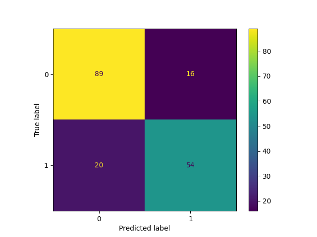
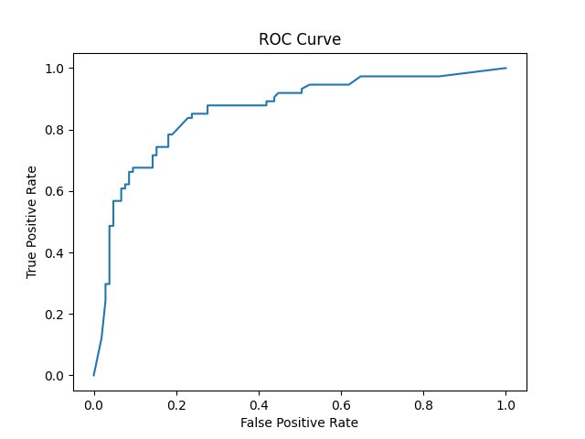
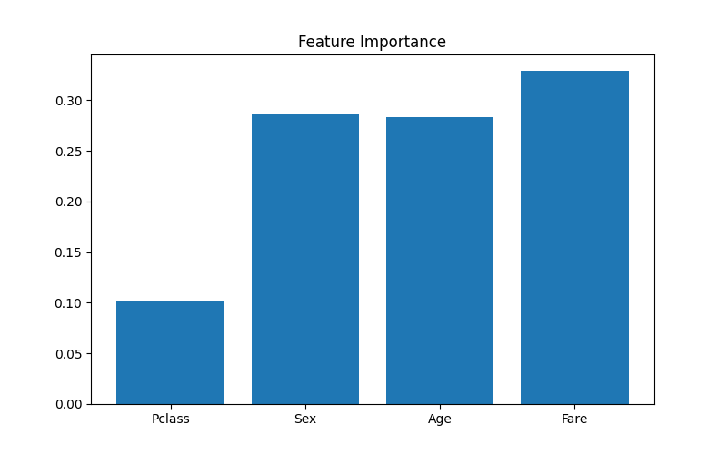

# 🤖 Predictive Modeling Using Machine Learning


---

## 📌 Overview

This project builds a machine learning model using the Titanic dataset to predict passenger survival.

---

## 🚀 Algorithm Used

- Random Forest Classifier

---

## 📊 Model Evaluation

✔ Accuracy Score

✔ Confusion Matrix

✔ ROC Curve

✔ Feature Importance

---

## 📈 Visualizations

### Confusion Matrix



---

### ROC Curve



---

### Feature Importance



---

## 📂 Project Structure

```
Predictive-Modeling-Using-Machine-Learning
│
├── data/
│   └── cleaned_dataset.csv
│
├── images/
│   ├── confusion_matrix.png
│   ├── roc_curve.png
│   └── feature_importance.png
│
├── predictive_modeling.ipynb
├── requirements.txt
└── README.md
```

---

## 👩‍💻 Author

**Asifa Firdhouse**

Artificial Intelligence & Machine Learning Student

⭐ If you found this project useful, consider giving it a star!
